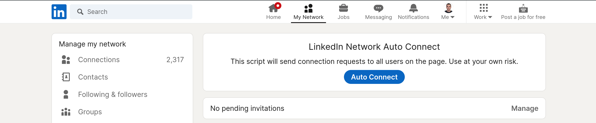

# LinkedIn Network Auto-Connect UserScript

This userscript automates the process of connecting with people on LinkedIn.

<!--  Image -->

## Usage

1. Install [Tampermonkey](https://www.tampermonkey.net/).
2. Click [the userscript](https://raw.githubusercontent.com/AlejandroAkbal/LinkedIn-Network-Auto-Connect-Userscript/main/src/main.user.js) and add to
   Tampermonkey.
3. Go to the [LinkedIn "My Network"](https://www.linkedin.com/mynetwork/) page.
4. Enjoy!

## Credit

- [LinkedIn](https://www.linkedin.com/)
